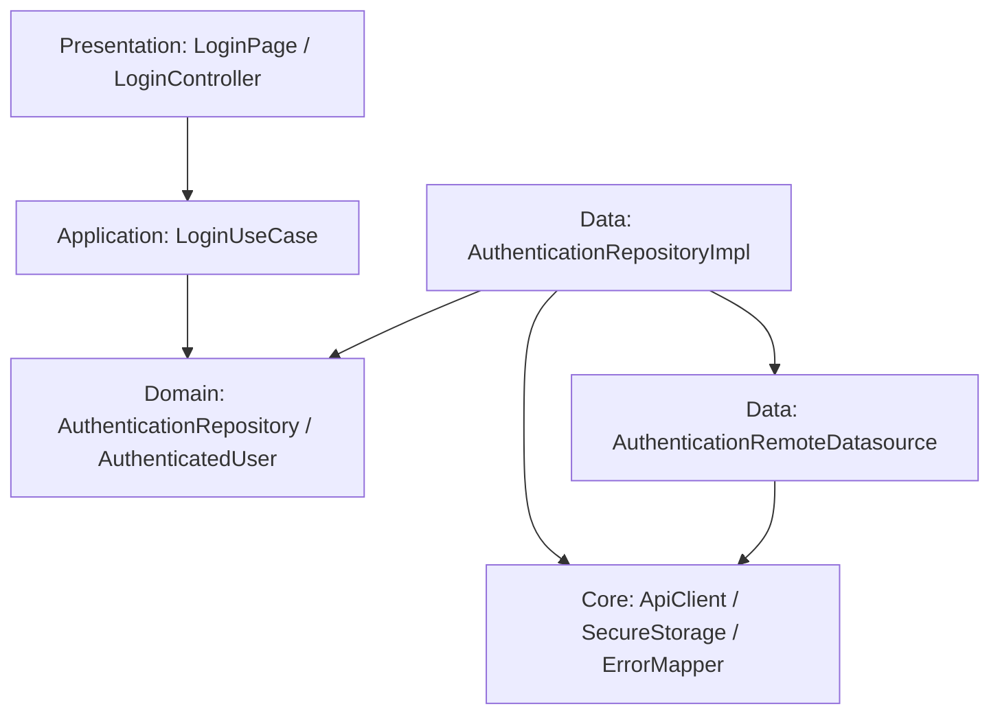

# Architecture

## Overview

The starter uses feature-first organization and light clean architecture.
Feature ownership is visible in the directory tree, while layers are added only
when they protect a real business or I/O boundary.

The design optimizes for:

- one obvious location for each responsibility;
- typed data and failure flow;
- replaceable external boundaries;
- small, independently testable units;
- low ceremony for presentation-only features.

## Feature first

Business behavior belongs under `lib/features/<feature_name>/`. A developer
should be able to understand a feature by reading that directory without
searching global model, provider, or service folders.

Authentication is the full reference. Home is the small-feature reference.

## Layer responsibilities

| Layer | Owns | Must not own |
| --- | --- | --- |
| Presentation | pages, feature widgets, UI state, controllers | HTTP, DTO parsing, raw exceptions |
| Application | use cases and application orchestration | Flutter widgets, transport details |
| Domain | entities, business rules, repository contracts | Dio, Flutter UI, data implementation |
| Data | datasources, DTOs, mappers, repository implementation | user interface and route behavior |

## Dependency direction



The domain is the inward boundary. Data implements domain contracts; domain
never reaches outward to data.

## Runtime login flow

```text
LoginPage
  → LoginController
  → LoginUseCase
  → AuthenticationRepository
  → AuthenticationRepositoryImpl
  → AuthenticationRemoteDatasource
  → ApiClient (when a real transport is added)
```

The V1 datasource is a deterministic fake so the reference flow runs without a
backend. The repository still maps the DTO to an entity, stores the token
through the secure storage abstraction, maps errors, and returns `Result<T>`.

## Core, shared, and feature

- `app`: application composition—bootstrap, environments, router, theme.
- `core`: business-neutral infrastructure—network, storage, errors, results,
  logging.
- `shared`: proven cross-feature widgets or validation with no business
  dependency.
- `features`: business capabilities and their local providers.

Core and shared cannot import features. A feature-specific widget remains in its
feature even if multiple pages in that same feature use it.

## Allowed imports

| From | Allowed |
| --- | --- |
| Presentation | same feature presentation/application/domain, feature provider tokens, app theme/router contracts, shared |
| Application | same feature domain, business-neutral core results if required |
| Domain | Dart SDK and domain-safe immutable annotations |
| Data | same feature domain/data, core infrastructure |
| Feature provider composition | same feature application/domain/data and core |
| App | core, shared, feature entry pages/controllers for composition |
| Core | Dart/Flutter infrastructure packages; never features |
| Shared | app design tokens and Flutter; never features |

## Forbidden imports

- Domain → data, application, presentation, Dio, or Flutter UI.
- Presentation → Dio, datasource, DTO, raw JSON, or Dio response.
- Core/shared → any business feature.
- One feature → another feature's private data layer.
- Widget → API client or secure storage.

The `authentication.dart` or `<feature>.dart` barrel is the feature's intended
public surface. Do not export internal DTOs merely for convenience.

Cross-layer Riverpod construction lives in a feature-root file such as
`authentication_providers.dart`. That file may import implementations to wire
them to domain contracts, but contains no business behavior. Application and
presentation files import provider tokens from this composition file rather
than importing a data implementation.

## Small feature example

Home has no external data and no independent business rule:

```text
features/home/
├── presentation/
│   ├── pages/home_page.dart
│   └── widgets/environment_badge.dart
└── home.dart
```

Adding empty domain/data/application directories would communicate false
complexity and is prohibited.

## Full feature example

Authentication has validation, orchestration, external data, and persistence:

```text
features/authentication/
├── presentation/  # page, form, controller, state
├── application/   # login use case
├── domain/        # user entity and repository contract
├── data/          # datasource, DTOs, mapper, repository implementation
└── authentication.dart
```

Use this shape only when each directory has a concrete responsibility.
