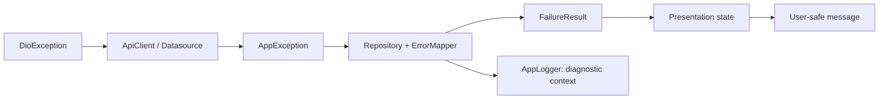

# Error handling

## Typed error pipeline



Each step reduces external detail and adds application meaning. Raw transport
objects never escape the data boundary.

## DioException

DioException is transport-specific. `ApiClient` catches it and uses
`ErrorMapper.mapDioException` to classify connectivity, timeout, response status,
and unknown failures. A datasource may add endpoint/schema context but must not
return Dio exceptions or responses.

## AppException

AppException represents an external or infrastructure failure in an
application-owned type:

- NetworkAppException
- UnauthorizedAppException
- ForbiddenAppException
- NotFoundAppException
- ValidationAppException
- ServerAppException
- TimeoutAppException
- UnknownAppException

It can retain diagnostic message/status metadata. That message is for logging
and mapping, not direct UI display.

## Failure

Failure is a safe, expected operation outcome. Failure types parallel the
categories above and contain controlled user-facing copy. Repositories use
`ErrorMapper.mapException` to prevent transport/schema/internal messages from
reaching presentation.

Validation failures may carry a deliberate field/business message. Server or
unknown failures use generic retry guidance.

## Result

Repository operations return:

```dart
Result<AuthenticatedUser>
```

A `Success<T>` contains typed domain data. A `FailureResult<T>` contains a
Failure. This makes both branches exhaustive with Dart pattern matching and
avoids `null`, magic booleans, and thrown expected errors in controllers.

## UI state

Controllers convert Result into explicit presentation state: idle, loading,
success, or failure. UI renders state and sends events; it does not run the
mapping pipeline.

Disable repeated actions while loading. Announce error text using a live
semantic region where appropriate. Retry must invoke the controller again, not
the datasource.

## User messages

- Never display raw response body, exception text, stack trace, endpoint, or
  status internals.
- Make copy actionable when the user can recover.
- Keep authentication/security messages intentionally non-specific where
  specificity could reveal account state.
- Localization should be introduced as an optional module before scaling
  user-facing copy.

## Logging

Repository/boundary code logs operation context, captured error, and stack
trace through AppLogger. Do not log credentials, tokens, authorization headers,
or complete payloads. Development logging records request method/path only.
Production diagnostics remain off until an approved observability module exists.

## Adding a new failure

1. Confirm the category changes application behavior or user guidance.
2. Add an AppException only if the external boundary needs the distinction.
3. Add the Failure and user-safe default.
4. Extend ErrorMapper exhaustively.
5. Add mapping tests for both transport and application exception paths.
6. Add controller/widget coverage if the UI response changes.
